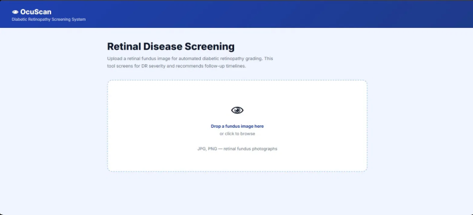
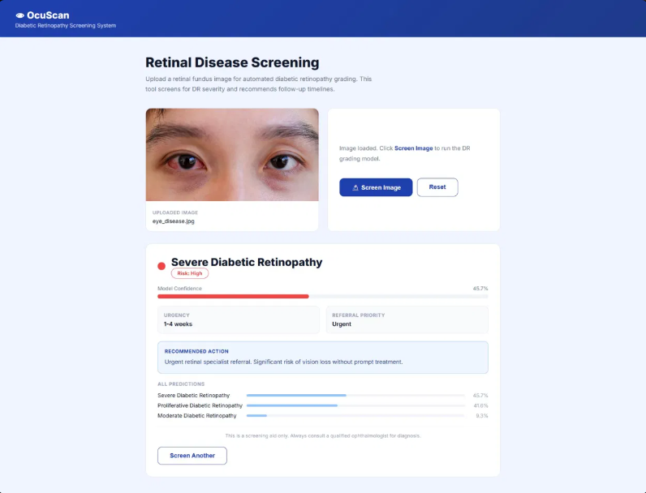
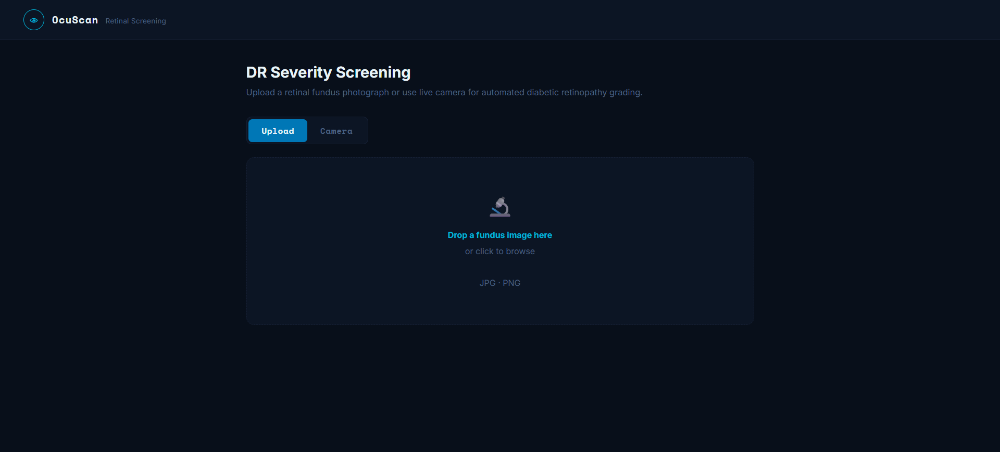
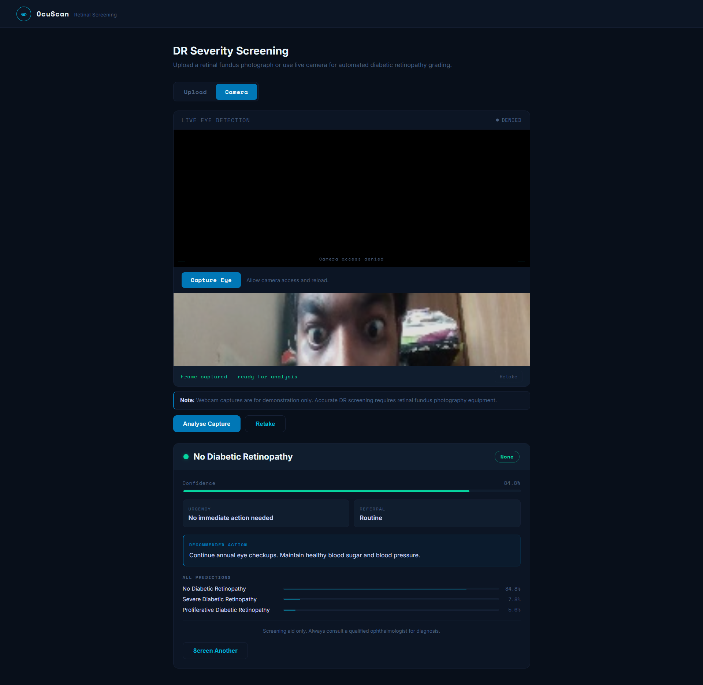
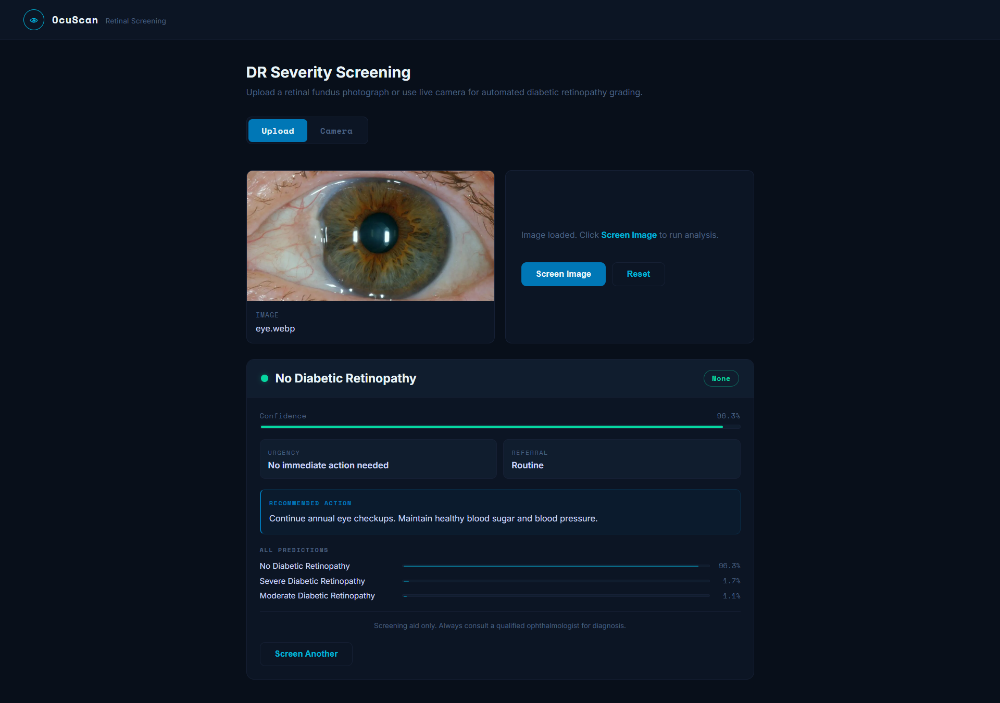
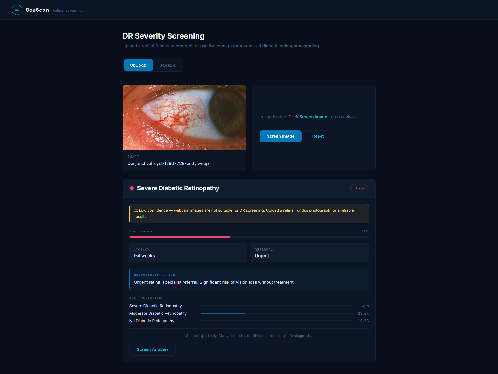

# eye-disease-screener

> Originally developed: August 2025 - rebuilt with real dataset and camera feed: 2026

Screens retinal fundus images for diabetic retinopathy severity across 5 grades (No DR, Mild, Moderate, Severe, Proliferative). Built as a screening aid for clinics without on-site ophthalmologist access - a positive screen means refer for specialist evaluation, not a diagnosis.

## screenshots

| August 2025 - original version | |
|---|---|
|  |  |

| 2026 - rebuilt version | |
|---|---|
|  |  |
|  |  |

## how it works

Each fundus image goes through a 108-feature extraction pipeline. Features are grouped into four categories:

**Colour and channel statistics** - RGB means and standard deviations at full resolution, plus separate red, green, and blue histogram bins (32 + 16 + 16 + 8 bins) for fine-grained tonal analysis.

**Texture and edge features** - edge density via gradient magnitude, edge variance, high-edge ratio, spot density, and a composite texture score. These pick up the microaneurysm and haemorrhage patterns that differentiate DR grades.

**Region analysis** - centre region (optic disc area) brightness, contrast, and vessel density. Ring brightness ratio comparing inner and outer optic disc zones as a cup-to-disc proxy.

**Clinical composite features** - haemorrhage proxy (very dark pixel ratio × red channel dominance), exudate proxy (very bright pixels that are not green-dominant), texture score (edge variance × spot density). Each is grounded in what an ophthalmologist actually looks for.

A GradientBoostingClassifier (400 trees, learning rate 0.04) maps these features to one of 5 DR grades. Results below 75% confidence trigger a warning rather than a silent low-quality prediction.

The live camera mode uses MediaPipe FaceMesh (468 landmarks, refined iris tracking) to detect eyes in real time, draw contours on each eye, and capture a frame for analysis. Camera stops automatically after capture.

## model performance

| Version | Features | Trees | CV Accuracy |
|---|---|---|---|
| v1 (synthetic) | 10 | 200 | ~53% |
| v2 (APTOS) | 52 | 300 | 57.4% |
| v3 (APTOS) | 108 | 400 | 60.5% |

60.5% is the ceiling for hand-engineered features on this dataset. A fine-tuned CNN would reach 85%+. That's the next step in the roadmap.

## dataset

APTOS 2019 Diabetic Retinopathy Detection - Kaggle
https://www.kaggle.com/datasets/sovitrath/diabetic-retinopathy-224x224-2019-data

5 classes: No_DR, Mild, Moderate, Severe, Proliferate_DR
1,858 samples used for training (limited by minority class sizes)

## running it

```bash
cd backend
pip install -r requirements.txt
python ../model/train.py
python app.py
```

Open `frontend/index.html` in Chrome. Backend runs on port 5014.

## stack

Python · Flask · scikit-learn · Pillow · NumPy · MediaPipe · JavaScript

## limitations

Webcam captures are demonstration only - the model needs retinal fundus photographs for meaningful results. Standard webcam images of a face will always trigger the low-confidence warning. Clinical use requires fundus imaging hardware.
